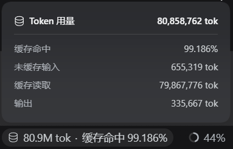

# dsh-cache-hit-precision

English | [中文](README.md)

[](https://github.com/vrvtvy/dsh-cache-hit-precision/actions/workflows/ci.yml)
[](LICENSE)

A [DeepSeek Harness](https://deepseek-harness.github.io/deepseek-harness/) (DSH)
Web plugin: it renders the built-in cache-hit reading of the composer statistics
row with **three-decimal precision in place** (`缓存命中 98%` ->
`缓存命中 98.460%`), and keeps the same reading in the *Token usage* dialog and
the status line in step.

Nothing is added to the UI. The plugin claims an invisible seat in the composer
dock, reads the same `tokenUsage` projection the built-in pill reads, and
refines only the cache-hit reading — turns, steps, throughput, totals, and the
dialog's other buckets (uncached input, cache read, cache write, output) are
untouched. No geometry is changed.

## What it looks like



Both the *cache hit* row of the dialog and the status line
(`80.9M tok · 缓存命中 99.186%`) are replaced in place with the three-decimal
reading; everything else matches the built-in rendering exactly.

## Why three decimals

The built-in formatter refuses to round a partial hit up to `100%`: it prints
an integer until that would collapse, then widens the precision until the miss
is visible. This readout keeps that promise from a three-decimal base instead
of an integer one, so day-to-day movements of the hit rate stay visible:

| cache read / billed input | built-in   | this plugin |
| ------------------------- | ---------- | ----------- |
| 123 / 1123                | `11%`      | `10.953%`   |
| 9995 / 10000              | `99.95%`   | `99.950%`   |
| 999999 / 1000000          | `99.9999%` | `99.9999%`  |
| 9995 / 9995               | `100%`     | `100.000%`  |

The denominator is DSH's own — the sum of the three disjoint prompt-side
billing buckets, `uncachedInputTokens + cacheReadTokens + cacheWriteTokens` —
so the two readings can only differ in precision, never in meaning. Rounding is
half-up in exact integer arithmetic, so a percentage never inherits float
drift.

## How it works

Refinement is immediate: the built-in dialog renders its first frame at integer
precision, so the plugin re-refines inside the mutation observer's own
microtask — after React's commit, before the browser paints — whenever an
anchor mounts or React rewrites a reading in place. The low-precision first
frame is never seen; anything else settles through one debounced rescan per
mutation burst.

The plugin anchors on the `data-composer-stats` container of the statistics
row, on the `data-session-stats-usage` attribute of the session usage dialog's
row list, and on the two shipped locale strings, so it keeps working across
minor theme and layout changes.

## Install

This package is not published to npm, so it installs from its own directory
rather than by name.

Clone the repository first:

```sh
git clone https://github.com/vrvtvy/dsh-cache-hit-precision.git
```

**Desktop app** — open *Settings → Plugins*, click *Add plugin*, enter the
**absolute path** of the cloned directory, and click *Install*:

```
D:/wherever/dsh-cache-hit-precision
```

The path must be absolute; forward slashes work on every platform (`D:/…` on
Windows, `/home/you/…` elsewhere). Restart DSH when the install finishes.

**Command line** — only for a profile the desktop app does not own:

```sh
dsh plugin --profile web add /absolute/path/to/dsh-cache-hit-precision
```

The desktop app manages its own profile exclusively, so it refuses
`--profile desktop` from the CLI; use *Settings → Plugins* there instead.

## Compatibility

Built for DSH `0.2.0-rc.*` (verified on `0.2.0-rc.2`), whose composer
statistics row is rendered by `@deepseek-ai/dsh-client-ui-chat`'s
`StatsPills`. An upstream rework of that markup or copy may require a plugin
update.

The per-turn usage panel (`data-turn-usage-details`) is deliberately left
alone: its cache-hit reading is a different aggregate — one turn rather than
the whole session — so refining it to the pill's number would misreport it.

DSH `0.1.x` exposed a different stats line and is not supported by this
version.

## Notes

- Reads no network, uploads nothing.
- Registers one slot entry and no styles; uninstalling leaves no residue.

## Test

```sh
npm test
```

## Credits & license

Continued from [Cheng-cheng9669](https://github.com/Cheng-cheng9669)'s
[dsh-cache-precision](https://github.com/Cheng-cheng9669/dsh-cache-precision),
adapted to DSH 0.2. Released under the [MIT](LICENSE) license.
